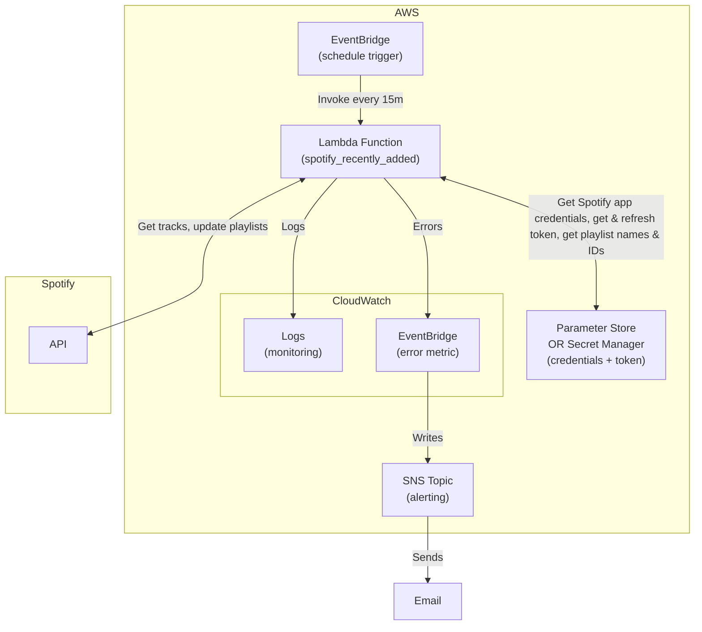

# Overview

This project is an **AWS Lambda function that automatically maintains "Recently Added" style playlists in Spotify**, similar to the "Recently Added" *Smart Playlist* feature you may remember from iTunes.

The Lambda runs on a schedule (default: every 15 minutes) and:

- Looks at your "Liked Songs" library, sorted by most recently added.
- Splits that list into chunks (default: 3 playlists, 200 songs each).
- Keeps each chunk in sync with a dedicated playlist (default names):

  - **Recently Added** → your latest songs.
  - **Older Recently Added** → the next batch.
  - **Even Older Recently Added** → the next batch after that.

This creates a rolling set of playlists that automatically refresh as you add new music to your library.

The implementation uses:

- **AWS Lambda** for execution.
- **AWS Parameter Store** (default) or **AWS Secrets Manager** to store Spotify app credentials and cached tokens.
- **AWS EventBridge (CloudWatch Events)** for scheduling.
- **[Spotipy](https://spotipy.readthedocs.io/en/)** (Python client for the Spotify Web API) for playlist management.
- **AWS Lambda Powertools** for structured logging.
- **AWS CloudWatch alarm** and **AWS SNS** for alerting on failures.

It’s lightweight, serverless, and (once deployed) completely hands-off.



---

# Setup

## Prerequisites

Make sure you have:

- An **AWS account** with permissions for Lambda, EventBridge, and Parameter Store or Secret Manager.
- A **Spotify Developer account** to create an app and get your credentials.
- **Python 3.13+** installed, with a virtual environment if desired.
- **AWS CLI** installed and configured.

## Spotify App & Credentials

1. Go to the [Spotify Developer Dashboard](https://developer.spotify.com/dashboard/) and create a new app.
2. Copy your **Client ID** and **Client Secret**.
3. Set your Redirect URI (suggested: `http://127.0.0.1:8000/callback`) for authentication.

## Secrets Backend Setup

You can choose between **AWS Parameter Store** (default, in AWS free tier) or **AWS Secrets Manager** (not in AWS free tier). Both use the same naming format.

1. Create a new Parameter Store parameter or Secrets Manager secret (default name: `/spotify/oauth`) with the following JSON structure:

```json
{
  "client_id": "<client id>",
  "client_secret": "<client secret>"
}
```

AWS CLI equivalent:

```bash
# Parameter Store (Default)
aws ssm put-parameter \
  --name /spotify/oauth \
  --value '{"client_id": "<client id>", "client_secret": "<client secret>"}' \
  --type SecureString

# Secrets Manager
aws secretsmanager create-secret \
  --name /spotify/oauth \
  --secret-string '{"client_id": "<client id>", "client_secret": "<client secret>"}'
```

## Run Script Locally (First-Time Auth)

You need to run the function once locally to open a window and log in to Spotify, granting the app access to your library.
Once authenticated, your token is cached in your chosen secrets backend and will auto-refresh. If you go a long time without running the app and the token expires, just run the script locally again.

1. Install dependencies:

```bash
pip install -r app/requirements.txt
```

2. Set any [environment variables](#environment-variables) you want to override.

3. Run:

```bash
python app/lambda_function.py
```

4. Authenticate in the window that appears and ensure the script completes successfully.

## Create Lambda Layer

The Lambda function requires `spotipy` and `boto3`. Create a Lambda layer with them installed:

1. Install dependencies and ZIP them:

```bash
pip install spotipy boto3 -t python/
zip -r spotipy_boto3.zip python/
```

2. Create a new Lambda layer (default name: `spotipy_boto3`) by uploading the ZIP and setting runtime to Python 3.13.

3. Note the layer ARN — you’ll need it when creating the Lambda function.

4. Cleanup:

```bash
rm -rf python/ spotipy_boto3.zip
```

AWS CLI equivalent:

```bash
aws lambda publish-layer-version \
  --layer-name spotipy_boto3 \
  --zip-file fileb://spotipy_boto3.zip \
  --compatible-runtimes python3.13
```

## Create IAM Role

Permissions needed depend on which secrets backend you choose.

1. Create an IAM role (default name: `spotify_recently_added_role`) with:

    - Trusted entity type: AWS Service.
    - Use case: `Lambda`.
    - Permissions:  `AWSLambdaBasicExecutionRole` and `AmazonSSMFullAccess` (if using Parameter Store, default) or `SecretsManagerReadWrite` (if using Secrets Manager).

2. Note the role ARN — you’ll need it when creating the Lambda function.

AWS CLI equivalent:

```bash
aws iam create-role \
  --role-name spotify_recently_added_role \
  --assume-role-policy-document '{"Version":"2012-10-17","Statement":[{"Effect":"Allow","Principal":{"Service":"lambda.amazonaws.com"},"Action":"sts:AssumeRole"}]}'

aws iam attach-role-policy \
  --role-name spotify_recently_added_role \
  --policy-arn arn:aws:iam::aws:policy/service-role/AWSLambdaBasicExecutionRole

# Parameter Store (Default)
aws iam attach-role-policy \
  --role-name spotify_recently_added_role \
  --policy-arn arn:aws:iam::aws:policy/AmazonSSMFullAccess

# Secrets Manager
aws iam attach-role-policy \
  --role-name spotify_recently_added_role \
  --policy-arn arn:aws:iam::aws:policy/SecretsManagerReadWrite
```

## Create Lambda Function

1. Package the app:

```bash
zip -r spotify_recently_added.zip -j app/*
```

2. Create the Lambda function (default name: `spotify_recently_added`) via uploading ZIP. Required configurations:
    - Runtime: `python3.13`.
    - Layers: `spotipy_boto3` layer created earlier and [Powertools for AWS Lambda (Python)](https://docs.powertools.aws.dev/lambda/python/latest/#lambda-layer_1).
    - Timeout: 15 minutes.
    - Execution Role: use the IAM role created earlier.
    - Environment variables: see [environment variables](#environment-variables).
    - Reserved concurrency: 1 (prevents overlapping executions).
    - Retry attempts: 0, maximum event age: 60s (avoids old retries)

3. Test the Lambda with any test event to confirm it works.

4. Cleanup:

```bash
rm spotify_recently_added.zip
```

AWS CLI equivalent:

```bash
aws lambda create-function \
  --function-name spotify_recently_added \
  --runtime python3.13 \
  --handler lambda_function.lambda_handler \
  --zip-file fileb://spotify_recently_added.zip \
  --layers <spotipy_boto3 layer ARN> <AWS Powertools ARN> \
  --role <role ARN> \
  --timeout 900

aws lambda put-function-concurrency \
  --function-name spotify_recently_added \
  --reserved-concurrent-executions 1

aws lambda put-function-event-invoke-config \
  --function-name spotify_recently_added \
  --maximum-retry-attempts 0 \
  --maximum-event-age-in-seconds 60

aws lambda invoke --function-name spotify_recently_added /dev/stdout
```

## Set Up Lambda Schedule

1. Add a trigger in Lambda:
   Configuration → Triggers → Add trigger → EventBridge (CloudWatch Events).

    - Rule name (default): `spotify_recently_added_schedule`.
    - Schedule expression (default): rate(15 minutes).

AWS CLI equivalent:

```bash
aws events put-rule \
  --name spotify_recently_added_schedule \
  --schedule-expression "rate(15 minutes)"

aws lambda add-permission \
  --function-name spotify_recently_added \
  --statement-id spotify_recently_added_schedule_permission \
  --action "lambda:InvokeFunction" \
  --principal events.amazonaws.com \
  --source-arn <schedule ARN>

aws events put-targets \
  --rule spotify_recently_added_schedule \
  --targets "Id"="spotify_recently_added_trigger","Arn"="<lambda ARN>"
```

## (Optional) Set Up Alerting on Failure

1. Create a CloudWatch alarm (default name: `spotify_recently_added_alarm`):
    - Metric: Lambda → by function name → `spotify_recently_added` → Errors.
    - Statistic: Sum.
    - Period: 1800s.
    - Threshold: > 1.
    - Notification: new SNS topic/email subscription (e.g., `spotify_recently_added_sns`).

AWS CLI equivalent:

```bash
aws sns create-topic --name spotify_recently_added_sns

aws sns subscribe \
  --topic-arn <topic ARN> \
  --protocol email \
  --notification-endpoint <your email>

aws cloudwatch put-metric-alarm \
  --alarm-name spotify_recently_added_alarm \
  --actions-enabled \
  --alarm-actions <SNS ARN> \
  --metric-name Errors \
  --namespace AWS/Lambda \
  --statistic Sum \
  --dimensions '[{"Name":"FunctionName","Value":"spotify_recently_added"}]' \
  --period 1800 \
  --evaluation-periods 1 \
  --datapoints-to-alarm 1 \
  --threshold 1 \
  --comparison-operator GreaterThanThreshold \
  --treat-missing-data missing
```

---

# Environment Variables

| Variable              | Default Value                                                             | Description                                                                                                   |
| --------------------- | ------------------------------------------------------------------------- | ------------------------------------------------------------------------------------------------------------- |
| `SECRETS_BACKEND`     | `PS`                                                                      | Secrets backend to use. `PS` (Parameter Store) or `SM` (Secrets Manager).                                     |
| `PLAYLIST_NAMES`      | `["Recently Added", "Older Recently Added", "Even Older Recently Added"]` | Names of playlists to create or sync (JSON array). Must match the number of chunks.                           |
| `PLAYLIST_LENGTH`     | `200`                                                                     | Number of tracks in each playlist (Spotify max per playlist is 10,000).                                       |
| `OAUTH_NAME`          | `/spotify/oauth`                                                          | Name of parameter/secret storing Spotify `client_id` and `client_secret`.                                     |
| `TOKEN_NAME`          | `/spotify/token`                                                          | Name of parameter/secret used by Spotipy to cache OAuth tokens.                                               |
| `PLAYLIST_NAME`       | `/spotify/playlists`                                                      | Name of parameter/secret storing playlist names and IDs.                                                      |
| `AWS_REGION`          | `us-east-2`                                                               | AWS region for Lambda and secrets backend.                                                                    |
| `REDIRECT_URI`        | `http://127.0.0.1:8000/callback`                                          | Redirect URI for Spotify OAuth. Must match the value set in your Spotify app.                                 |
